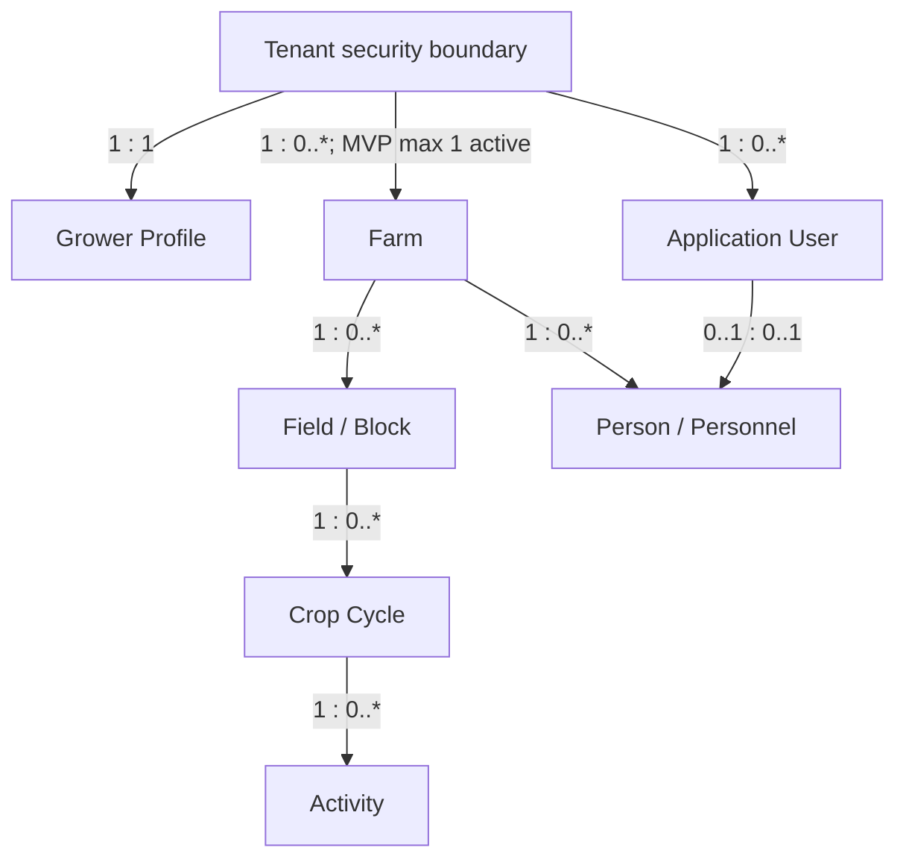
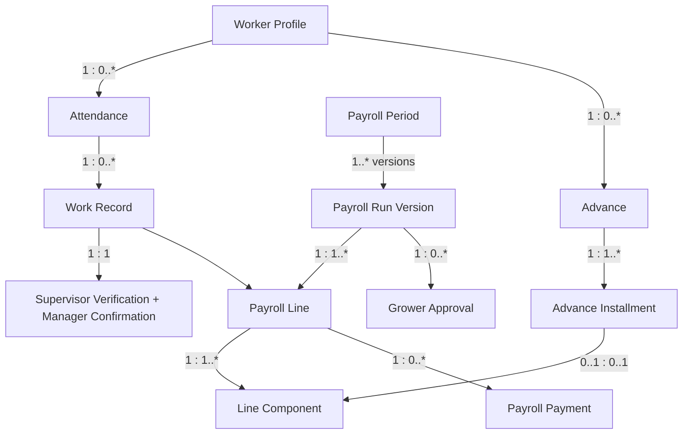
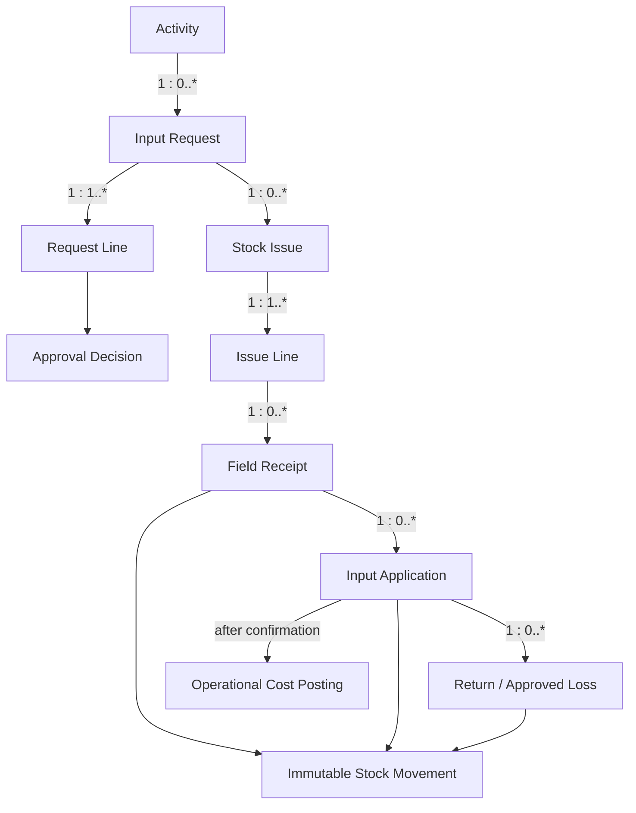
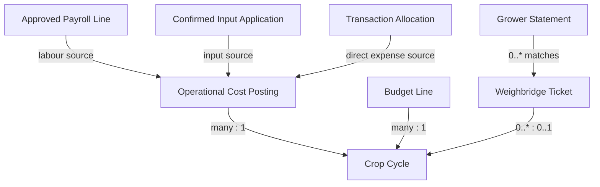

# Cane360 MVP Logical Data Model Specification

> **Implementation reference.** Generated from the approved `Cane360_MVP_Logical_Data_Model_v0.1.docx` baseline. The DOCX remains the approved publication artifact; this Markdown version preserves its entities, relationships, invariants, and implementation guidance in a searchable format.

Entity relationships, data ownership, integrity rules, and implementation boundaries

**Version:** 0.1 - Logical baseline

**Source:** Cane360 MVP Product Requirements v0.1

**Market:** Zimbabwe; Hippo Valley, Mkwasine, and Triangle pilot

**Scope:** Modules 1-6; responsive online web MVP

**Prepared:** 11 August 2026

**Status:** Ready for product and engineering review

> **Model objective.** Define the minimum durable data structure needed to prove what happened in each field, trace every controlled input to application or resolution, and support monthly payroll from verified work evidence.

# Document purpose

This specification turns the approved product requirements into a logical entity-relationship model. It defines domain entities, identifiers, cardinalities, lifecycle ownership, derived values, tenant boundaries, audit strategy, and the invariants that the database and API must enforce.

It is intentionally technology-aware but not a physical schema. PostgreSQL, PostGIS, Entity Framework Core mappings, indexes, partitions, column types, and migration scripts are the next engineering design step.

## Document map

| **Section** | **Use**                                                                                |
|-------------|----------------------------------------------------------------------------------------|
| 1-3         | Model scope, conventions, and the top-level domain map.                                |
| 4-7         | Entity catalogues for farm/crop, labour/payroll, inventory, and finance/mill.          |
| 8-12        | Cross-cutting approvals, evidence, state, integrity, formulas, security, and history.  |
| 13-15       | Aggregate boundaries, PostgreSQL/PostGIS handoff, and implementation validation items. |

# 1. Scope and modelling decisions

## 1.1 Locked product boundaries

| **Area**         | **Logical model decision**                                                                                                                                        |
|------------------|-------------------------------------------------------------------------------------------------------------------------------------------------------------------|
| Tenant           | A tenant represents one grower customer. The model permits multiple farms later, while an MVP invariant limits the tenant to one active farm.                     |
| Users and actors | Application users are separate from named operational people. A manager can enter a supervisor or storekeeper attestation without implying that person logged in. |
| Farm and store   | One active farm and one store per farm in MVP. Historical or inactive records remain addressable.                                                                 |
| Crop cost object | CropCycle is the mandatory operational and cost-allocation anchor for labour, applied inputs, and directly allocated expenses.                                    |
| Inventory truth  | StockMovement is the immutable stock ledger. Field application is separate from store issue and is the control point for consumption and cost.                    |
| Payroll truth    | A versioned monthly PayrollRun is built from approved evidence. The grower approves a specific version; later material edits invalidate that approval.            |
| Money            | All MVP money is USD. Currency and exchange-rate entities are not exposed in v0.1.                                                                                |
| Mill records     | Weighbridge tickets and grower statements are evidence records only; division-of-proceeds accounting remains out of scope.                                        |

## 1.2 Explicit exclusions from the model

- General ledger, chart of accounts, journal entries, accounts payable/receivable, tax, VAT, and statutory payroll.

- Multi-farm worker sharing, cooperative tenancy, mill portals, transport scheduling, and direct mill or payment APIs.

- Offline synchronization, device queues, conflict resolution, AI, IoT, satellite imagery, and equipment maintenance.

- Fuel as an MVP catalogue category. The inventory model can support it later without a structural redesign.

## 1.3 Design stance

The model favours explicit operational events over mutable totals. Quantities on hand, unaccounted input, payroll balances, and crop-cycle costs are derived from posted source records. Materialised summaries may be introduced for performance, but they are never the authoritative source.

# 2. Modelling conventions

| **Convention**   | **Rule**                                                                                                                                                       |
|------------------|----------------------------------------------------------------------------------------------------------------------------------------------------------------|
| Identifiers      | Every entity has an opaque logical identifier, recommended as UUID. Human-readable codes remain tenant-scoped alternate keys.                                  |
| Tenant ownership | Every farm-owned entity resolves to tenant_id. Direct tenant_id storage is recommended on high-volume or security-sensitive tables even when derivable.        |
| Natural keys     | Natural identifiers such as field code, national ID, ticket reference, and payroll period receive explicit scoped uniqueness rules; they are not primary keys. |
| Time             | event_date/event_at records when work happened; created_at records when it was entered. Approval, posting, and reversal timestamps are separate.               |
| People           | created_by_user_id identifies the authenticated user. Operational person fields identify issuer, recipient, supervisor, worker, or confirmer.                  |
| Statuses         | State is owned by the aggregate root. Child lines cannot independently claim a state that contradicts the root.                                                |
| History          | Approved, posted, paid, or closed records are not overwritten. Corrections reverse or supersede originals and preserve the chain.                              |
| Soft archive     | Reference/master records may be archived. Posted operational records are retained and cannot be hard-deleted through the application.                          |
| Quantities       | Quantity always pairs with a unit. Conversion is permitted only through configured item/unit rules; display rounding never changes stored precision.           |
| Money            | Money stores amount and USD currency assertion. Financial calculations use fixed decimal precision and defined rounding at component and total levels.         |

## 2.1 Common metadata contract

Farm-owned aggregates should carry the following metadata directly or through a shared persistence convention:

- id; tenant_id; status; created_at; created_by_user_id; last_changed_at; last_changed_by_user_id.

- event_date or event_at where an operational event occurs separately from entry time.

- operational_person_id and operational_role when the authenticated user records on another person's behalf.

- source reference and evidence links where source sheets, receipts, photos, or statements support the record.

- superseded_by_id, reversal_of_id, or CorrectionRecord link when a material record is corrected.

## 2.2 Relationship notation

| **Notation**     | **Meaning**                                                                                                        |
|------------------|--------------------------------------------------------------------------------------------------------------------|
| 1                | Exactly one related record is required.                                                                            |
| 0..1             | The relationship is optional and permits at most one record.                                                       |
| 1..\*            | At least one child is required before the parent can post or close.                                                |
| 0..\*            | Any number of children may exist, including none.                                                                  |
| MVP max 1 active | The logical model permits history/future growth; a filtered uniqueness rule enforces the current product boundary. |

# 3. Domain overview

The top-level model keeps commercial/security identity separate from farm operations. Farm is the operational ownership root; CropCycle is the production and cost root; Activity connects agronomy, labour, and inventory evidence.

*Figure 1. Core tenant, farm, field, crop-cycle, and activity relationships.*

## 3.1 Domain ownership

| **Domain**            | **Aggregate roots**                                                  | **Authoritative outputs**                                                    |
|-----------------------|----------------------------------------------------------------------|------------------------------------------------------------------------------|
| Identity and farm     | Tenant, Farm, Field, CropCycle                                       | Tenant isolation, farm setup, field register, crop history.                  |
| Activities and labour | Activity, Attendance, WorkRecord                                     | Field diary, work evidence, verified piece quantities.                       |
| Inventory control     | StockReceipt, InputRequest, StockIssue, InputApplication, StockCount | Stock ledger, input trace, unaccounted quantity, stock variance.             |
| Payroll               | PayrollPeriod, PayrollRun, WorkerAdvance                             | Approved payroll version, payslip data, payment records, advance balance.    |
| Finance and mill      | OperationalTransaction, Budget, WeighbridgeTicket, GrowerStatement   | Direct cost, budget comparison, cost per hectare/tonne, mill evidence.       |
| Cross-cutting         | ApprovalDecision, EvidenceDocument, ControlException, AuditEvent     | Approval proof, evidence chain, exception resolution, immutable audit trail. |

## 3.2 Central joins

- CropCycle is the central join for activity, verified labour, confirmed input application, direct expense allocation, harvest result, and cost reporting.

- Person is the central operational actor. WorkerProfile extends a Person; TenantMembership connects an ApplicationUser to the person represented in a tenant.

- OperationalCostPosting is a controlled projection from approved payroll, confirmed input application, and posted direct expenses. It is not a general ledger.

- EvidenceLink, ApprovalDecision, ControlException, CorrectionRecord, and AuditEvent are cross-cutting records whose subject references must be constrained by application and persistence rules.

# 4. Identity, farm, field, and crop entities

| **Entity**           | **Purpose**                                                     | **Logical keys and attributes**                                                 | **Relationships / constraints**                                                                                        |
|----------------------|-----------------------------------------------------------------|---------------------------------------------------------------------------------|------------------------------------------------------------------------------------------------------------------------|
| Tenant               | Commercial and security boundary for one grower customer.       | id; tenant_code; status; provisioned_at                                         | Owns memberships, farm data, settings, audit events. MVP permits one active Farm.                                      |
| GrowerProfile        | Grower/customer details and owner contact context.              | tenant_id (1:1); legal/display name; contacts                                   | Exactly one active profile per Tenant; owner Person may be linked.                                                     |
| ApplicationUser      | Authenticated identity independent of any single tenant.        | id; identity_provider_subject; email; status                                    | Joins tenants through TenantMembership; cannot be used as an operational actor without the represented Person link.    |
| TenantMembership     | User access and security role within a tenant.                  | tenant_id + user_id; security_role; status; person_id?                          | Unique active user/tenant pair. Grower and manager permissions derive here.                                            |
| Farm                 | Operating farm owned by the tenant.                             | id; tenant_id; farm_code; name; status; location                                | MVP filtered uniqueness limits one active Farm per Tenant. Owns Store, Field, Person, Worker, Supplier.                |
| Person               | Named farm person used for operational attribution.             | id; farm_id; display name; phone?; active dates                                 | May represent owner, manager, supervisor, storekeeper, issuer, recipient, or worker; login is optional.                |
| PersonRoleAssignment | Time-bounded operational role held by a Person.                 | person_id; role_code; effective_from/to; is_primary                             | One active primary farm manager per Farm; multiple supervisors/storekeepers are allowed.                               |
| Store                | Single physical inventory store for the farm.                   | id; farm_id; code; name; status                                                 | Exactly one active Store per Farm in MVP; owns stock movements and counts.                                             |
| Field                | Sugarcane field/block and area reference.                       | id; farm_id; code; name; status; declared_ha; mapped_ha; reporting_area_source  | Active code unique within Farm; many CropCycles; geometry is optional.                                                 |
| FieldBoundaryVersion | Versioned geographic boundary and calculated area.              | field_id; version_no; geometry; source; calculated_ha; effective_at             | One current version at a time; invalid geometry cannot be current; original imports remain traceable.                  |
| FieldLineProfile     | Standardised row/line context for piece work.                   | field_id; standard_line_length_m; estimated_line_count; numbering scheme        | At most one active profile per Field; WorkScope can reference line ranges or work sections.                            |
| CropVariety          | Configurable sugarcane variety reference.                       | id; tenant/global scope; code; name; active status                              | Referenced by CropCycle; archived varieties remain valid in history.                                                   |
| CropCycle            | Plant-cane or ratoon production period and central cost object. | id; field_id; cycle_type; ratoon_no?; variety_id; dates; status; expected yield | Only one Active or Ready-for-harvest cycle per Field. New operations prohibited after Closed.                          |
| HarvestResult        | Actual harvest closure values required for cost per tonne.      | crop_cycle_id (1:1); harvest_date; actual_tonnes; source/evidence               | Required before a harvested cycle can calculate cost/tonne; correction preserves prior result.                         |
| FarmSetting          | Tenant/farm configuration with effective dates.                 | farm_id; setting_key; typed value; effective_from/to                            | Controls thresholds, tolerances, approval assignment, late-entry limits, and reference behaviour; changes are audited. |

## 4.1 Key field and crop invariants

- Field declared area and mapped area are independent. reporting_area_source selects the denominator used by all cost/area reports and must be shown in report output.

- CropCycle.cycle_type = Ratoon requires ratoon_no. Plant cane must not carry a ratoon number.

- Operational Activity, WorkRecord, InputApplication, and directly allocated expenses require a CropCycle in an operational state.

- Archiving a Field never hides its historical cycles, activities, stock applications, labour, or costs.

# 5. Activity, labour, advance, and payroll entities

Labour evidence begins with attendance and an activity-linked WorkRecord. Supervisor verification and manager confirmation are distinct facts even when the manager enters both. A payroll run consumes only eligible evidence and freezes a version for grower approval.

*Figure 2. Verified work evidence through monthly payroll and payment.*

| **Entity**             | **Purpose**                                                                             | **Logical keys and attributes**                                                          | **Relationships / constraints**                                                                                          |
|------------------------|-----------------------------------------------------------------------------------------|------------------------------------------------------------------------------------------|--------------------------------------------------------------------------------------------------------------------------|
| ActivityType           | Configurable kind of field work and measurement rules.                                  | id; code; name; planned/unplanned flags; quantity basis                                  | Referenced by Activity and InventoryApplicationRule; archive instead of delete.                                          |
| Activity               | Planned or unplanned work against a field and active crop cycle.                        | id; crop_cycle_id; field_id; type_id; planned/actual dates; status; supervisor_person_id | Owns work evidence and input workflow. Field must match CropCycle.field_id.                                              |
| WorkerProfile          | Paid worker attributes extending a farm Person.                                         | person_id (1:1); employment type; national_id_cipher/hash/mask; active dates             | Worker belongs to one Farm. National ID hash unique within Farm, subject to authorised correction flow.                  |
| WorkerRate             | Effective-dated pay rule for daily, monthly, hectare, line, or optional overtime basis. | worker_id or role/activity scope; basis; USD rate; effective dates                       | No overlapping active rates for the same scope. WorkRecord stores the applied rate snapshot.                             |
| Attendance             | Present/absent record for a worker on a work date.                                      | worker_id + work_date; status; field_id if present                                       | Unique worker/date. Present requires one Field; absent cannot have paid WorkRecord.                                      |
| WorkRecord             | Worker participation and calculated work evidence.                                      | attendance_id; activity_id; pay basis; quantity; unit; applied rate; amount; status      | Activity field must equal Attendance.field_id. Multiple activities allowed only in that same field/date.                 |
| WorkScope              | Line range or named section used to prevent duplicate piece claims.                     | work_record_id; scope type; start/end line or section code                               | Overlapping scope for the same Activity is blocked or routed to an authorised exception.                                 |
| WorkVerification       | Two-stage evidence for labour and piece quantity.                                       | work_record_id (1:1); supervisor_person_id/verified_at; manager_user_id/confirmed_at     | Supervisor attestation is operational, not login approval. Both stages required for piece work.                          |
| WorkerAdvance          | Approved amount recoverable from future payroll.                                        | id; worker_id; amount; approved_at; status; outstanding amount (derived)                 | Defaults to three instalments; schedule changes require grower approval and reason.                                      |
| AdvanceInstallment     | Planned recovery in a specific payroll period.                                          | advance_id; sequence; due period; scheduled amount; status                               | Installments sum to advance amount. Balance reduces only when an approved payroll component posts.                       |
| PayrollPeriod          | Monthly payroll calendar and lock boundary.                                             | farm_id; period_start/end; status                                                        | Unique month/period per Farm. Closing locks included attendance/work evidence.                                           |
| PayrollRun             | Versioned payroll calculation submitted to the grower.                                  | period_id; version_no; status; calculated/submitted timestamps; totals                   | Unique version per period. A material edit creates/recalculates a new version and invalidates current approval.          |
| PayrollLine            | One worker result within a payroll run version.                                         | run_id + worker_id; gross; deductions; net; evidence hash/status                         | Unique worker per run. Must reconcile to line components and eligible evidence.                                          |
| PayrollLineComponent   | Earning, addition, deduction, advance recovery, or adjustment.                          | line_id; type; source reference; quantity/rate; amount; sign                             | Source is unique within a run to prevent double inclusion. Advance component links one installment.                      |
| PayrollPayment         | Cash or mobile-money settlement against a payroll line.                                 | line_id; method; amount; date; status; provider/reference/recipient?                     | Many payments support part-payment. Total posted payment cannot exceed net pay without authorised correction.            |
| PaymentAcknowledgement | Evidence that a cash/mobile payment was acknowledged or confirmed.                      | payment_id (1:1); acknowledgement status; person/date; evidence link                     | Cash requires acknowledgment status; mobile money requires provider, recipient, transaction reference, date, and status. |

## 5.1 Payroll eligibility rule

> **Eligibility.** A PayrollLineComponent may draw from a WorkRecord only when attendance is Present, field allocation is valid, required verification is complete, the work has not already been consumed by another payroll version, and no blocking exception remains.

## 5.2 Version and lock behaviour

- PayrollRun version_no is immutable once submitted. Recalculation after a material edit produces a new version or returns the current draft to a pre-submission state.

- ApprovalDecision identifies the exact PayrollRun version approved by the grower. It cannot float to a newer version.

- Closing PayrollPeriod locks the included Attendance, WorkRecord, WorkerRate snapshot, advance posting, and approved payroll version.

- Corrections after closure use authorised reopening or a later-period adjustment; the original line and payment evidence remain visible.

# 6. Inventory and field-application entities

Inventory uses two connected but distinct truths: the store ledger records where stock moved; the field-application chain records whether issued input arrived, was used, returned, lost with approval, or remains unaccounted for.

*Figure 3. Input request-to-application trace and posting points.*

| **Entity**               | **Purpose**                                                           | **Logical keys and attributes**                                                                             | **Relationships / constraints**                                                                                                |
|--------------------------|-----------------------------------------------------------------------|-------------------------------------------------------------------------------------------------------------|--------------------------------------------------------------------------------------------------------------------------------|
| UnitOfMeasure            | Reference unit for stock, application, area, and work quantities.     | id; code; dimension; decimal precision; active status                                                       | Conversions require explicit same-dimension rules; historical records retain original unit.                                    |
| InventoryItem            | Controlled farm input.                                                | id; farm_id; item code; name; category; stock unit; costing method; reorder level                           | Code unique within Farm; negative stock disabled; archived items remain reportable.                                            |
| InventoryApplicationRule | Planned rate and tolerance for an item/activity combination.          | item_id; activity_type_id; rate quantity/unit; area basis; tolerance; effective dates                       | No overlapping current rule for the same scope. Variance uses the rule effective on activity date.                             |
| Supplier                 | Farm-scoped source of purchased inputs.                               | id; farm_id; code/name; contacts; active status                                                             | Referenced by receipts and operational transactions; never owns stock.                                                         |
| InventoryLot             | Optional batch/lot and expiry identity.                               | item_id; lot code; expiry; supplier/source                                                                  | Unique within Item/Store when used. MVP may allow unbatched items by configuration.                                            |
| StockReceipt             | Goods-received document header.                                       | id; store_id; supplier_id; receipt date; source reference; status                                           | Owns one or more lines. Posting creates receipt StockMovement rows.                                                            |
| StockReceiptLine         | Received item, lot, quantity, and unit cost.                          | receipt_id; line no; item/lot; quantity/unit; USD unit cost                                                 | Positive quantity/cost. Reversal, not overwrite, after posting.                                                                |
| InputRequest             | Activity-linked request for planned inputs.                           | id; activity_id; requested_by; date; status; approval level                                                 | Must reference active CropCycle through Activity; owns one or more lines.                                                      |
| InputRequestLine         | Requested item and planned quantity/rate.                             | request_id; item; quantity/unit; planned rate; estimated USD cost                                           | Unique item/rule per line scope; available stock and variance shown at approval.                                               |
| StockIssue               | Approved handover from store for an activity.                         | id; request_id; store_id; issue date; issuer/recipient Person; status                                       | Cannot post without valid approval. One request may be fulfilled by multiple issues.                                           |
| StockIssueLine           | Actual item/lot quantity issued.                                      | issue_id; request_line_id; item/lot; quantity/unit; issue unit cost                                         | Cannot exceed approved remaining quantity or available stock. Posting creates an issue StockMovement.                          |
| FieldReceipt             | Operational confirmation that issued stock reached the field.         | id; issue_id; field/cycle/activity; received date; recipient; status                                        | Field/cycle/activity must match request chain; captures discrepancy timing and reason.                                         |
| FieldReceiptLine         | Quantity received for an issue line.                                  | field_receipt_id; issue_line_id; received quantity/unit                                                     | Cumulative received cannot exceed posted issued quantity without correction approval.                                          |
| InputApplication         | Confirmed application event for an activity.                          | id; activity_id; application date; area/lines; supervisor verification; manager confirmation; status        | May consolidate eligible receipts for the same activity. Confirmation is the input-consumption and cost-posting control point. |
| InputApplicationLine     | Applied/returned/lost accounting for a received input line.           | application_id; receipt_line_id; applied qty; returned qty; approved loss qty; rate variance                | Applied \<= received. Unaccounted is derived across related issue/receipt/application/return/loss records.                     |
| StockReturn              | Return header acknowledged by the store.                              | id; issue/application reference; return date; sender/receiver; status                                       | Stock increases only when the return is posted as received by the Store.                                                       |
| StockReturnLine          | Returned item/lot and quantity.                                       | return_id; issue line/application line; item/lot; quantity/unit                                             | Cannot exceed eligible unapplied quantity. Posting creates a return StockMovement.                                             |
| InventoryLoss            | Approved damaged, expired, spilled, or otherwise lost quantity.       | id; source line; quantity; reason; status; approval                                                         | Requires grower ApprovalDecision. Posts a loss cost category and never restores stock.                                         |
| StockCount               | Physical count event at a store cut-off.                              | id; store_id; count date/time; status; counted by; approved by                                              | One cut-off snapshot; closing requires every included line to be resolved or accepted.                                         |
| StockCountLine           | Expected, counted, and variance quantity per item/lot.                | count_id; item/lot; expected; counted; variance                                                             | Expected is reproduced from StockMovement at cut-off. Variance does not change stock by itself.                                |
| StockAdjustment          | Authorised stock correction arising from count or exceptional review. | id; store/item/lot; quantity delta; reason; source count?; status                                           | Grower approval required. Posting creates an adjustment StockMovement.                                                         |
| StockMovement            | Append-only authoritative inventory ledger entry.                     | id; store/item/lot; movement type; signed quantity; unit; event/posting dates; source type/id; reversal_of? | Never edited or deleted after posting. Stock on hand is the sum of posted movements by store/item/lot.                         |

## 6.1 Quantity reconciliation

> **Control formula.** Unaccounted quantity = posted issued quantity - confirmed applied quantity - posted returned quantity - approved loss quantity. A non-zero balance keeps the control chain open and blocks normal Activity closure.

## 6.2 Required posting boundaries

| **Event**                   | **Ledger effect**                                                                    | **Crop-cost effect**                                                          |
|-----------------------------|--------------------------------------------------------------------------------------|-------------------------------------------------------------------------------|
| Stock receipt posted        | Positive StockMovement.                                                              | None; inventory asset/value only.                                             |
| Stock issue posted          | Negative StockMovement.                                                              | None; issue is not consumption.                                               |
| Field application confirmed | No new store movement.                                                               | OperationalCostPosting for applied quantity at locked issue cost.             |
| Return received by store    | Positive StockMovement.                                                              | Reverses/avoids cost for returned quantity.                                   |
| Loss approved               | No additional store movement if already issued; otherwise appropriate loss movement. | Loss/variance OperationalCostPosting, separate from normal input application. |
| Stock adjustment posted     | Signed StockMovement.                                                                | Adjustment/variance cost treatment according to approved reason.              |

# 7. Finance, cost, budget, and mill entities

Cane360 records operational money and produces crop-cycle cost views without becoming a statutory accounting system. A controlled cost projection prevents input or labour costs from being counted twice.

*Figure 4. Crop-cycle cost sources and limited mill evidence.*

| **Entity**             | **Purpose**                                                              | **Logical keys and attributes**                                                        | **Relationships / constraints**                                                                                                                                            |
|------------------------|--------------------------------------------------------------------------|----------------------------------------------------------------------------------------|----------------------------------------------------------------------------------------------------------------------------------------------------------------------------|
| OperationalTransaction | Simple USD income or expense record.                                     | id; farm_id; type; category; event date; payee/payer; amount; source reference; status | Not a journal entry. Posted transactions may be allocated to a CropCycle and corrected by reversal.                                                                        |
| TransactionAllocation  | Allocation of a transaction amount to field/crop cycle or farm overhead. | transaction_id; crop_cycle_id?; field_id?; amount; category                            | Allocations sum to transaction amount. Crop-cycle allocations create OperationalCostPosting for expenses.                                                                  |
| Budget                 | Farm or crop-cycle operating budget for a period/cycle.                  | id; farm_id; crop_cycle_id?; period; status; version                                   | One approved active version per scope; prior versions retained.                                                                                                            |
| BudgetLine             | Budget amount by cost category and optional activity/item scope.         | budget_id; category; scope reference; USD amount                                       | Used only for budget-versus-actual; never creates cost.                                                                                                                    |
| OperationalCostPosting | Append-only crop-cycle cost projection from approved source events.      | id; crop_cycle_id; category; USD amount; source type/id; posting date; reversal_of?    | Unique active posting per source/component prevents duplication. Sources: payroll component, confirmed application line, transaction allocation, approved loss/adjustment. |
| Mill                   | Reference mill for weighbridge and statement context.                    | id; code; name; location; active status                                                | Ticket reference uniqueness is scoped to Mill.                                                                                                                             |
| WeighbridgeTicket      | Manual delivery/weighbridge evidence.                                    | id; mill_id; ticket reference; date; gross/tare/net tonnes; field/cycle?; status       | Unique mill/ticket reference. Net tonnes required; field/cycle optional until documents are validated.                                                                     |
| GrowerStatement        | Uploaded statement plus manual summary totals.                           | id; mill_id; period; statement reference; total tonnes; total USD amount; match status | Stores EvidenceDocument; detailed division-of-proceeds logic excluded.                                                                                                     |
| StatementTicketMatch   | Manual or assisted association of ticket to statement.                   | statement_id + ticket_id; matched tonnes/amount?; status; reason                       | Ticket cannot be counted twice in the same statement; variances remain visible.                                                                                            |

## 7.1 Cost source precedence

| **Cost category**      | **Authoritative source**                                                 | **Posting trigger**                                             |
|------------------------|--------------------------------------------------------------------------|-----------------------------------------------------------------|
| Labour                 | Approved PayrollLineComponent linked to eligible WorkRecord evidence.    | Grower approval of the exact PayrollRun version.                |
| Applied input          | Confirmed InputApplicationLine valued from its issue/receipt cost basis. | Manager application confirmation after supervisor verification. |
| Direct expense         | Posted TransactionAllocation.                                            | OperationalTransaction posting.                                 |
| Approved loss/variance | Approved InventoryLoss or StockAdjustment.                               | Grower approval and posting.                                    |

## 7.2 Non-duplication rule

OperationalCostPosting must carry a stable source identity. A source component can have at most one unreversed posting for the same crop cycle and category. Corrections create reversing and replacement postings; reports sum active postings rather than re-reading mutable operational totals.

# 8. Cross-cutting approval, evidence, exception, correction, and audit entities

| **Entity**        | **Purpose**                                                           | **Logical keys and attributes**                                                                                 | **Relationships / constraints**                                                                                                                  |
|-------------------|-----------------------------------------------------------------------|-----------------------------------------------------------------------------------------------------------------|--------------------------------------------------------------------------------------------------------------------------------------------------|
| ApprovalDecision  | Immutable decision against an exact subject/version.                  | id; tenant_id; subject type/id/version; decision; approver user/person; role; timestamp; reason; supersedes?    | Used for exceptional input request, loss/adjustment, payroll run, and authorised reopening. Subject-specific policy validates the approver role. |
| EvidenceDocument  | Tenant-protected file metadata in object storage.                     | id; tenant_id; storage key; filename; media type; size/hash; uploaded by/at; classification                     | No public guessable URL. Access is authorised and audited; bytes are immutable after acceptance.                                                 |
| EvidenceLink      | Links evidence or source-sheet reference to a domain record.          | evidence_id?; subject type/id; evidence role; source-sheet reference; captured date                             | Supports activity, issue, application, payroll acknowledgement, receipt, ticket, statement, and correction evidence.                             |
| ControlException  | Actionable block, escalation, warning, or information finding.        | id; tenant_id; subject type/id; code; severity; opened/resolved dates; status; resolution                       | May be rule-generated or authorised. Blocking exceptions prevent the configured transition; resolution is audited.                               |
| CorrectionRecord  | Explicit link between original and correcting/reversing records.      | id; tenant_id; original type/id; correction type/id; reason; authorised by/at                                   | Original remains immutable. Correction chain must be acyclic and traceable.                                                                      |
| AuditEvent        | Append-only security and operational audit event.                     | id; tenant_id; event type; subject type/id; user; operational person; timestamp; correlation id; change summary | Covers create/change, transitions, approvals, reversals, exports, login, support access, and sensitive-data access.                              |
| GeneratedDocument | Repeatable document output such as payslip, cash register, or export. | id; tenant_id; document type; subject/version; generated by/at; filter snapshot; evidence document id           | Must identify source version and filters; generation/export creates AuditEvent.                                                                  |

## 8.1 Polymorphic subject rule

ApprovalDecision, EvidenceLink, ControlException, CorrectionRecord, AuditEvent, and OperationalCostPosting use logical subject/source references in this model. During physical design, the team must choose one of two enforceable patterns: module-specific foreign-key tables, or a registered aggregate-reference table that prevents dangling IDs. Unconstrained free-text type/id pairs are not acceptable.

## 8.2 Approval policy matrix

| **Subject**                            | **Normal approver**       | **Escalated approver**                         | **Critical constraint**                               |
|----------------------------------------|---------------------------|------------------------------------------------|-------------------------------------------------------|
| Planned input request within tolerance | Farm manager              | Grower may also approve                        | Approval must precede posted issue.                   |
| Above-plan/tolerance input request     | None                      | Grower                                         | Manager may submit but cannot self-authorise.         |
| Inventory loss/write-off/adjustment    | None                      | Grower                                         | Reason and quantity/value impact required.            |
| Payroll run version                    | None                      | Grower                                         | Approval binds exact version; manager cannot approve. |
| Closed-period/cycle correction         | Policy-defined submission | Grower or authorised support according to case | Reopen/correction event and reason must be audited.   |

# 9. Cardinality and uniqueness catalogue

| **ID**  | **Constraint**                                                            | **Enforcement expectation**                                                        |
|---------|---------------------------------------------------------------------------|------------------------------------------------------------------------------------|
| LDM-001 | Tenant has at most one active Farm in MVP.                                | Filtered unique constraint plus service rule.                                      |
| LDM-002 | Farm has exactly one active Store in MVP.                                 | Filtered unique constraint; setup transaction.                                     |
| LDM-003 | Farm has exactly one active primary manager assignment.                   | Filtered unique constraint on PersonRoleAssignment.                                |
| LDM-004 | Field code is unique within Farm while active.                            | Normalised alternate key; archive-aware uniqueness.                                |
| LDM-005 | A Field has at most one CropCycle in Active or Ready-for-harvest state.   | Filtered unique constraint and transition check.                                   |
| LDM-006 | Worker national ID fingerprint is unique within Farm.                     | Encrypted value plus deterministic fingerprint; authorised correction path.        |
| LDM-007 | Attendance is unique by Worker and work date.                             | Unique constraint.                                                                 |
| LDM-008 | A present worker has one Field allocation on a date.                      | Attendance owns field; WorkRecord activity field equality check.                   |
| LDM-009 | Piece WorkScope does not overlap within the same Activity scope.          | Exclusion/range constraint where feasible; otherwise transactional validator.      |
| LDM-010 | PayrollPeriod is unique by Farm and monthly date range.                   | Unique constraint plus non-overlapping-period check.                               |
| LDM-011 | PayrollRun version is unique within PayrollPeriod.                        | Unique period/version key.                                                         |
| LDM-012 | PayrollLine is unique by Run and Worker.                                  | Unique constraint.                                                                 |
| LDM-013 | Item code is unique within Farm; stock is non-negative by Store/Item/Lot. | Alternate key; transactional posting guard.                                        |
| LDM-014 | StockIssueLine cannot exceed approved outstanding request or stock.       | Serializable/locked posting transaction.                                           |
| LDM-015 | FieldReceipt cumulative quantity cannot exceed issued quantity.           | Aggregate check during receipt/correction posting.                                 |
| LDM-016 | Applied quantity cannot exceed field-received quantity.                   | Database check plus aggregate validation.                                          |
| LDM-017 | Returned plus applied plus approved loss cannot exceed issued quantity.   | Aggregate invariant across control chain.                                          |
| LDM-018 | Weighbridge ticket reference is unique within Mill.                       | Normalised mill/ticket alternate key.                                              |
| LDM-019 | OperationalCostPosting has one active posting per source/category/cycle.  | Unique active source projection key.                                               |
| LDM-020 | Posted StockMovement, AuditEvent, and approval decisions are immutable.   | Restricted database permissions and application policy; reversal-only update path. |

# 10. State ownership and transition dependencies

| **Aggregate**    | **Core states**                                                                                        | **Transition dependencies**                                                                                                          |
|------------------|--------------------------------------------------------------------------------------------------------|--------------------------------------------------------------------------------------------------------------------------------------|
| CropCycle        | Draft; Active; Ready for harvest; Harvested; Closed; Cancelled                                         | Activate only if no competing cycle. Harvest requires result. Closed rejects new operations.                                         |
| Activity         | Draft; Planned; In progress; Awaiting verification; Manager confirmation; Completed; Closed; Cancelled | Close only when labour verified and all controlled input quantities resolved.                                                        |
| InputRequest     | Draft; Requested; Approved; Rejected; Cancelled                                                        | Above tolerance requires grower approval; approval version precedes issue.                                                           |
| StockIssue       | Draft; Posted/Issued; Partially received; Received; Corrected/Cancelled                                | Posting requires stock and approval; posted issue corrected by reversal.                                                             |
| InputApplication | Draft; Applied; Awaiting verification; Manager confirmation; Closed; Exception; Corrected              | Applied \<= received; supervisor verification precedes manager confirmation; close requires zero unaccounted or approved resolution. |
| StockCount       | Draft; In progress; Review; Approved; Posted; Closed                                                   | Adjustment is separate; count does not change stock until approved posting.                                                          |
| PayrollPeriod    | Open; Calculating; Submitted; Approved/Rejected; Payment in progress; Paid/Part-paid; Closed           | Grower approval binds run version; close locks sources and requires configured payment/exception completion.                         |
| WorkerAdvance    | Draft; Approved; Active; Recovered; Written off/Cancelled                                              | Schedule adjustment requires approval; recovery posts only through approved payroll.                                                 |
| ControlException | Open; Acknowledged; Pending approval; Resolved; Superseded                                             | Blocking subject transition remains disabled until a valid resolution exists.                                                        |

## 10.1 Temporal dependency checks

- event_date may precede created_at; if the delay exceeds two calendar days, late_entry_reason is mandatory.

- Application confirmation more than 48 hours after work date is flagged and requires reason.

- No WorkRecord may enter a submitted/approved payroll if it changed after the run evidence snapshot without recalculation.

- FarmSetting, WorkerRate, and InventoryApplicationRule use the version effective on the operational event date, not entry date.

- A correction cannot backdate itself into a closed aggregate without an ApprovalDecision authorising reopen or adjustment handling.

# 11. Derived values and calculation ownership

| **Derived value**      | **Definition**                                                                    | **Authoritative inputs**                                                |
|------------------------|-----------------------------------------------------------------------------------|-------------------------------------------------------------------------|
| Stock on hand          | Sum of posted signed StockMovement quantities.                                    | Store, Item, Lot, posting cut-off.                                      |
| Unaccounted input      | Issued - applied - posted returned - approved loss.                               | Issue, application, return, loss records in one trace chain.            |
| Application rate       | Confirmed applied quantity / verified area or configured line basis.              | Application line, Activity actual coverage, effective application rule. |
| Piece pay by line      | Manager-confirmed lines x applied USD rate per standard line.                     | WorkRecord, WorkVerification, WorkerRate snapshot.                      |
| Advance outstanding    | Approved advance - posted payroll recoveries - approved settlements/write-offs.   | Advance and line components.                                            |
| Payroll net            | Earnings + additions - deductions.                                                | PayrollLineComponent signed amounts.                                    |
| Total crop-cycle cost  | Active labour + applied input + direct expense + approved variance cost postings. | OperationalCostPosting.                                                 |
| Cost per hectare       | Total crop-cycle cost / selected reporting hectares.                              | Cost postings and Field reporting-area choice.                          |
| Cost per tonne         | Total crop-cycle cost / actual harvested tonnes.                                  | Cost postings and HarvestResult; unavailable before actual tonnes.      |
| Stock count variance   | Counted quantity - movement-derived expected quantity at cut-off.                 | StockCountLine and StockMovement.                                       |
| Activity capture delay | created_at - event date/time.                                                     | Operational record timestamps.                                          |

## 11.1 Rounding and missing denominators

- Store base quantities and money at configured fixed precision. Apply rounding once per defined calculation boundary and retain the unrounded source quantity where needed.

- If reporting hectares or actual tonnes are absent or zero, cost per hectare/tonne is Not available; it is never displayed as zero.

- A displayed unit conversion must identify the source unit and rule. Conversion rounding cannot alter stock-control reconciliation.

# 12. Tenant, privacy, and audit model

## 12.1 Tenant isolation

- All farm-owned foreign-key paths must remain within the same Tenant. The API does not trust a client-supplied tenant identifier without authenticated membership.

- Cross-tenant identifiers return no usable data and do not reveal whether the record exists.

- Platform support access creates a TenantMembership-like time/purpose-bound context and an AuditEvent visible to authorised administrators.

- Background jobs, exports, file access, and report caches carry tenant context explicitly.

## 12.2 Sensitive data

| **Data**               | **Storage/display policy**                                                                                        | **Audit requirement**                                                     |
|------------------------|-------------------------------------------------------------------------------------------------------------------|---------------------------------------------------------------------------|
| National ID            | Encrypted value; deterministic tenant/farm-scoped fingerprint for duplicate detection; masked display by default. | Full-value access, export, correction, and decryption attempt.            |
| Mobile-money number    | Encrypted or strongly protected; masked except where payment preparation needs the full value.                    | Full display/export and payment record changes.                           |
| Evidence files         | Private object storage key; content hash; tenant-authorised signed access only.                                   | Upload, download, replace/supersede, and access denial where appropriate. |
| Audit/change summaries | Exclude secrets and full sensitive values; store field-level change indication or protected snapshot reference.   | Audit store itself is append-only and access-controlled.                  |

## 12.3 Audit event minimum

Each event records tenant, subject type/id/version, action, authenticated user, operational person when different, event time, request/correlation identifier, reason, and a safe change summary. AuditEvent does not replace domain history; it proves that the domain event or correction occurred.

# 13. Aggregate and transaction boundaries

| **Boundary**                                  | **Must be atomic**                                                                                   | **Can be eventual / projected**           |
|-----------------------------------------------|------------------------------------------------------------------------------------------------------|-------------------------------------------|
| Farm setup                                    | Tenant/Farm creation, first manager membership/role, one Store.                                      | Search index and dashboard readiness.     |
| Crop activation                               | Field state check and CropCycle activation.                                                          | Timeline/report refresh.                  |
| Activity completion                           | Required verification checks and close decision.                                                     | Diary/read model update.                  |
| Stock receipt/issue/return/adjustment posting | Document state, lines, StockMovement rows, available-stock guard, reversal links.                    | Dashboard and exception projection.       |
| Field application confirmation                | Application quantities, verification, unaccounted check, and cost-posting command/outbox.            | Cost report refresh if an outbox is used. |
| Payroll approval                              | Approval against exact run version, component totals, advance recovery posting intent, period state. | Generated payslips and reports.           |
| Payment posting                               | Payment amount/status and acknowledgement requirements.                                              | Printable register/export.                |
| Correction                                    | Authorisation, reversal/replacement records, source links, and audit event intent.                   | Recomputed dashboards and reports.        |

## 13.1 Recommended aggregate roots

Use aggregate roots that match the workflow command and invariant boundary: Farm, Field, CropCycle, Activity, StockReceipt, InputRequest, StockIssue, InputApplication, StockCount, WorkerAdvance, PayrollPeriod/PayrollRun, OperationalTransaction, Budget, WeighbridgeTicket, and GrowerStatement. Avoid a single Farm aggregate that loads every child record.

## 13.2 Concurrency

- All mutable aggregate roots carry an optimistic concurrency token/version.

- Stock posting additionally serialises or locks the relevant Store/Item/Lot balance key to prevent oversubscription.

- Approval commands compare subject version and fail if the subject changed after review.

- Long-running file/report work uses an outbox/job pattern; the domain commit does not wait for document rendering.

# 14. PostgreSQL and PostGIS physical-design handoff

The following decisions belong in the physical schema design, but this logical model establishes their acceptance criteria.

| **Topic**         | **Recommended direction**                                                                                                           | **Acceptance check**                                                                             |
|-------------------|-------------------------------------------------------------------------------------------------------------------------------------|--------------------------------------------------------------------------------------------------|
| Keys              | UUID primary keys; scoped alternate keys; explicit foreign keys including tenant-safe composites where useful.                      | No dangling or cross-tenant relationship.                                                        |
| PostGIS           | FieldBoundaryVersion geometry as validated Polygon/MultiPolygon in WGS84 (SRID 4326); compute geodesic hectares consistently.       | Invalid/self-intersecting boundary cannot become current; declared/mapped areas remain separate. |
| Active uniqueness | PostgreSQL partial unique indexes for active farm/store/manager/cycle and current configuration versions.                           | Database rejects competing active records.                                                       |
| Line overlap      | Use numeric-range/exclusion constraint for standard line ranges if the agreed WorkScope representation supports it.                 | Concurrent duplicate/overlapping piece claims are blocked.                                       |
| Sensitive fields  | Application/envelope encryption plus deterministic scoped fingerprint for national ID duplicate checks.                             | No plaintext in database logs, indexes, telemetry, or exports.                                   |
| Stock ledger      | Append-only StockMovement with signed decimal quantity and source/reversal keys; balance view/materialisation as optimisation only. | Balance reproduces exactly at a historic cut-off.                                                |
| Money             | numeric/decimal with explicit scale; no binary floating point.                                                                      | Payroll and cost totals reproduce across API/report runs.                                        |
| Temporal rules    | Effective date ranges for rates/settings/rules; exclusion or validator prevents overlap.                                            | Event-date lookup returns exactly one applicable version.                                        |
| Polymorphic links | Prefer module-specific FK tables or a registered aggregate reference; never unvalidated type/id text.                               | Deleting/archiving a subject cannot orphan approvals/evidence/audit.                             |
| Outbox            | Transactional outbox for report refresh, document generation, notifications, and blob finalisation.                                 | Domain commit and side effects are recoverable and idempotent.                                   |

## 14.1 Suggested schema/module boundaries

| **Module** | **Primary entity families**                                                                                                    |
|------------|--------------------------------------------------------------------------------------------------------------------------------|
| identity   | Tenant, GrowerProfile, ApplicationUser, TenantMembership.                                                                      |
| farm       | Farm, Person, roles, Store, Field, boundary, line profile, CropVariety, CropCycle, HarvestResult, settings.                    |
| activities | ActivityType, Activity, Evidence links, Activity exceptions.                                                                   |
| labour     | WorkerProfile, WorkerRate, Attendance, WorkRecord, WorkScope, WorkVerification, advances.                                      |
| inventory  | Items, units, rules, supplier, lots, receipts, requests, issues, field receipt/application, returns/losses, counts, movements. |
| payroll    | PayrollPeriod, run versions, lines/components, approvals, payments, generated payslips/registers.                              |
| finance    | Operational transactions/allocations, budgets, cost postings, Mill, tickets, statements/matches.                               |
| audit      | ApprovalDecision where shared, ControlException, CorrectionRecord, AuditEvent, export/generation events.                       |

# 15. Validation and decision register

| **ID**  | **Decision to validate**                                         | **Proposed build default**                                                           | **Validation evidence**                                  |
|---------|------------------------------------------------------------------|--------------------------------------------------------------------------------------|----------------------------------------------------------|
| DATA-01 | Worker national ID exception/correction process.                 | Required; encrypted plus fingerprint; grower-authorised correction.                  | Review pilot worker registers and onboarding exceptions. |
| DATA-02 | Line-range versus named work-section capture.                    | Support both; line ranges preferred where numbering is reliable.                     | Observe weeding records across three pilot areas.        |
| DATA-03 | Inventory batch/expiry requirement by item category.             | Optional lot; required by item configuration.                                        | Inspect fertiliser/chemical store practice.              |
| DATA-04 | Application unit conversions and tolerance source.               | Per item/activity rule with effective dates; no universal conversion.                | Validate actual application sheets and units.            |
| DATA-05 | Inventory costing method.                                        | Moving weighted average for pilot; lock application cost at confirmation.            | Compare with growers' current input-cost method.         |
| DATA-06 | Partial issue, field receipt, application, and return frequency. | Allow one-to-many partial events throughout the control chain.                       | Walk through real issue/application scenarios.           |
| DATA-07 | Cash acknowledgement evidence.                                   | Status plus named witness/recipient and optional signed sheet photo.                 | Review current cash payroll process.                     |
| DATA-08 | Mobile-money provider/reference uniqueness.                      | Provider plus transaction reference warning/unique rule within Farm.                 | Inspect historical payment references.                   |
| DATA-09 | Weighbridge ticket fields and gross/tare/net availability.       | Require mill, reference, date, and net tonnes; other weights optional.               | Obtain anonymised tickets when available.                |
| DATA-10 | Grower statement matching granularity.                           | Manual statement totals and optional ticket links; no DOP formula.                   | Obtain anonymised statements when available.             |
| DATA-11 | Farm overhead allocation to crop cycles.                         | Do not allocate automatically in MVP; report separately unless explicitly allocated. | Product-owner decision after first cost review.          |
| DATA-12 | Closed-period correction authority.                              | Grower approval; audited platform support only for technical recovery.               | Confirm operating policy before pilot go-live.           |

## 15.1 Engineering readiness checklist

- Product owner approves the entity names, MVP invariants, and proposed defaults in DATA-01 through DATA-12.

- Engineering converts this model into a physical PostgreSQL/PostGIS schema with column types, foreign keys, partial unique indexes, range constraints, and migration order.

- API design assigns command/query ownership to the aggregate boundaries in Section 13 and specifies idempotency for posting commands.

- QA derives database-level tests for LDM-001 through LDM-020 and end-to-end tests for the three golden paths.

- UX flows preserve the same state ownership and explicitly show event date, entry time, operational actor, approval, exception, and correction context.

## 15.2 Traceability to MVP outcomes

| **Outcome**              | **Primary entities**                                                                                                                           | **Proof generated**                                                                                                                               |
|--------------------------|------------------------------------------------------------------------------------------------------------------------------------------------|---------------------------------------------------------------------------------------------------------------------------------------------------|
| Better crop records      | Field, CropCycle, Activity, Attendance, WorkRecord, EvidenceLink, HarvestResult.                                                               | Field diary with actual dates, named actors, late-entry flag, evidence, work, inputs, and cost history.                                           |
| Reduced input leakage    | InputRequest/Line, ApprovalDecision, StockIssue/Line, FieldReceipt/Line, InputApplication/Line, Return, Loss, StockMovement, ControlException. | Full request-to-application trace, unaccounted quantity, application-rate variance, stock-count variance, and resolution evidence.                |
| Reliable payroll records | WorkerProfile, Attendance, WorkRecord/Scope/Verification, Advance/Installment, PayrollPeriod/Run/Line/Component, ApprovalDecision, Payment.    | Monthly payroll tied to valid attendance and verified work, exact grower-approved version, advance recovery, payment record, and acknowledgement. |

> **Next design artifact.** Use this logical model to create the screen-by-screen UX flows for the crop-record, input-accountability, and payroll golden paths. Every screen flow should reference the aggregate state and validation rule it changes.

# Approval record

| **Role**                          | **Name** | **Decision** | **Date / notes** |
|-----------------------------------|----------|--------------|------------------|
| Product owner / founder           |          | Pending      |                  |
| Pilot grower representative       |          | Pending      |                  |
| Pilot farm-manager representative |          | Pending      |                  |
| Engineering lead                  |          | Pending      |                  |
| Design lead                       |          | Pending      |                  |
